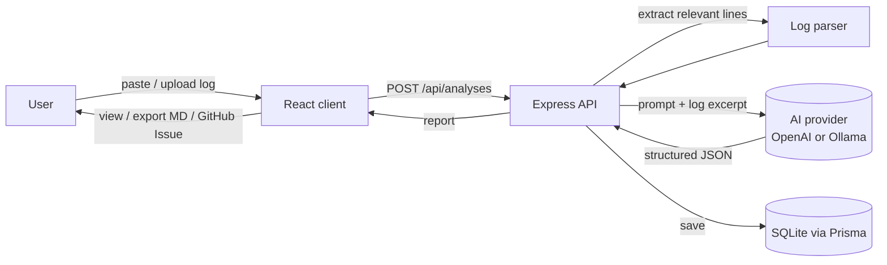

# Architecture

LogLens is a small full-stack application with a clean separation between the
**frontend** (what the user sees), the **backend** (the brain), and the
**AI provider** (the analysis engine).

## High-level overview



## Components

| Layer       | Tech                          | Responsibility                                                       |
| ----------- | ----------------------------- | -------------------------------------------------------------------- |
| Client      | React + TypeScript + Tailwind | Input UI, render report, history, export Markdown / GitHub Issue     |
| API         | Node.js + Express + TS        | Validate input, orchestrate parsing + AI, persist, expose REST       |
| Parser      | Pure TS function              | Extract the most relevant log lines (ERROR/WARN/Exception/…)         |
| AI provider | OpenAI **or** Ollama          | Turn the log excerpt into a structured report (behind one interface) |
| Database    | SQLite (Prisma ORM)           | Store analysis history                                               |

## Request lifecycle (analyze a log)

1. User pastes a log or uploads a `.txt` / `.log` file in the client.
2. Client sends the text to `POST /api/analyses`.
3. The **parser** scans the text and extracts the relevant lines (keywords:
   `ERROR`, `WARN`, `Exception`, `Failed`, `Timeout`, plus stack-trace lines).
   This keeps the prompt small, cheaper, and more focused.
4. The excerpt is sent to the **AI provider** with a prompt that asks for a
   strict JSON report (see [`prompts.md`](./prompts.md)).
5. The API validates the JSON, saves the analysis with Prisma, and returns it.
6. The client renders the report and offers **Markdown export** and a
   **copy-ready GitHub Issue**.

## Key design decisions

- **AI provider abstraction.** A single `AIProvider` interface with two
  implementations (`OpenAIProvider`, `OllamaProvider`) selected via the
  `AI_PROVIDER` env var. The rest of the app never imports a vendor SDK
  directly — easy to swap, easy to test with a fake provider.
- **Parse before prompting.** We don't send the whole file to the model. The
  parser narrows it down first: cheaper, faster, and more accurate.
- **Structured output.** The AI must return JSON matching a fixed schema, so the
  app can rely on the shape instead of parsing free-form prose.
- **SQLite first.** Zero-config local DB. The Prisma schema is written so that
  switching to PostgreSQL later is a one-line provider change.

## Folder structure

```text
loglens/
├── client/   # React + TS + Tailwind frontend
├── server/   # Express + TS backend (parser, AI provider, routes)
├── prisma/   # schema.prisma + migrations
├── docs/     # architecture, prompt design, screenshots
├── examples/ # sample logs you can try the app with
└── .github/  # CI workflow
```
